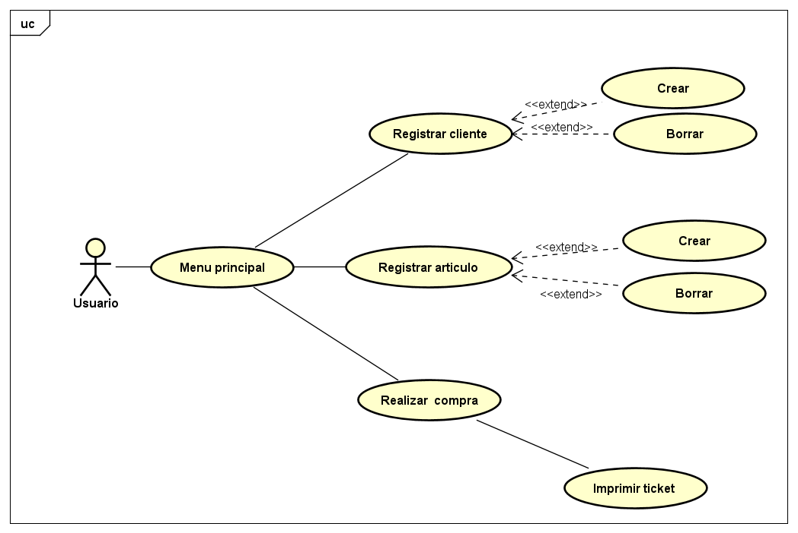
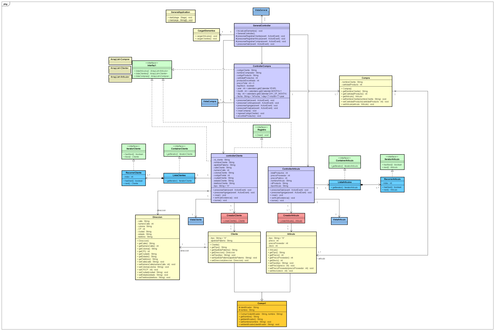
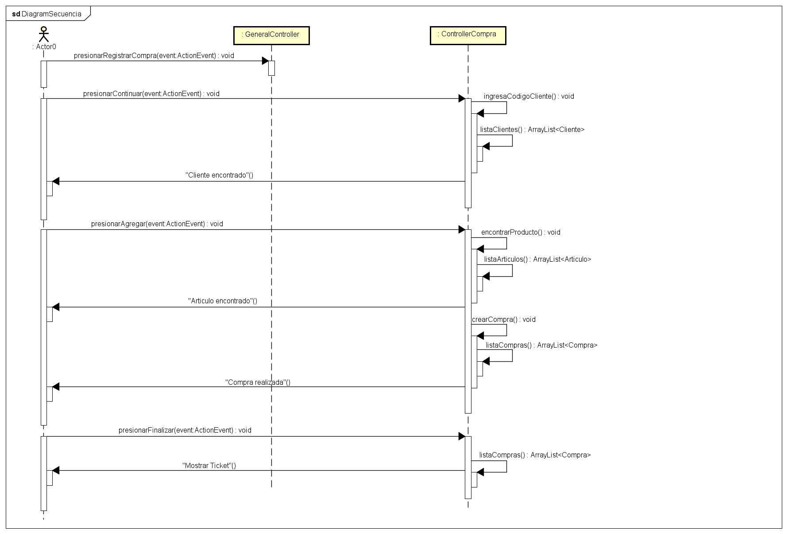
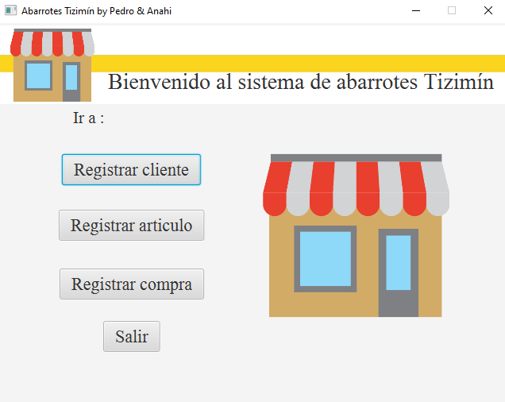
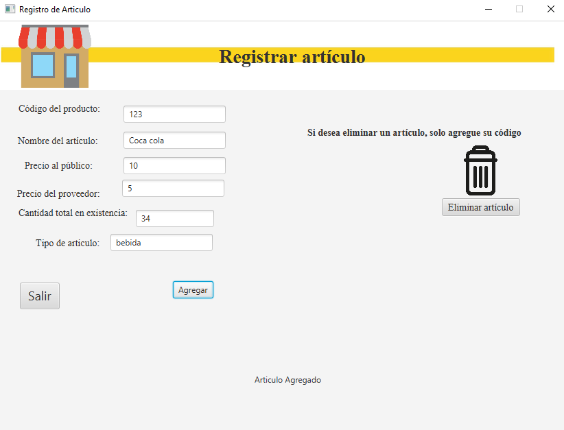
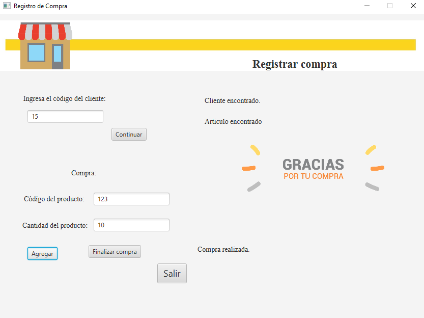
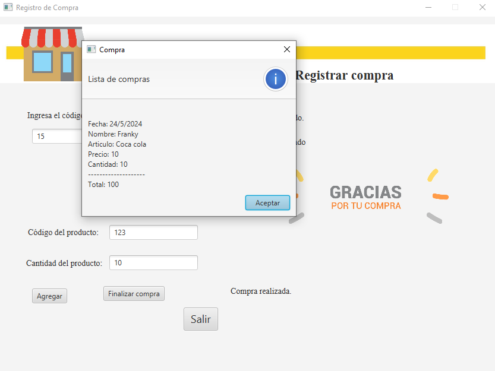

# Sistema abarrotes Tizimín 
## Colaboradores: 
 * Pedro Jose Bacab Pech 
 * Anahí del Rosario Dzul Can 

 ## Descripción: 

  Este proyecto fue hecho por estudiantes, con el fin de demostrar la aplicabilidad y la impotancia de los diagramas(casos de uso, de clase, colaboración, etc...) y los patrones de diseño(En este proyecto Iterator y Factory).

  El proyecto trata sobre un sistema de abarrotes de la ciudad de Tizimín el cual cumple con las siguiente funciones:

  * Registro de clientes
  * Registro de articulo
  * Registro de compras

  El proyecto cuenta con una interfaz gráfica desarrollada en JavaFX.

## Diagramas

### Diagrama de casos de uso

### Diagrama de clases

### Diagrama de secuencia(Abarca el registro de compra)

**Si desea ver los demás diagramas puede revisar la carpeta llamada "Diagramas", ahi los encontrará todos tanto como los archivos .asta**

## Vistas previas del programa

### Menú principal

### Registrar cliente

### Registrar artículo

### Registrar compra

### Impresión del ticket

## Conclusión

En conclusión el proyecto fue elaborado para demostrar el uso de los diagramas UML, principalmente el de clases, desarrollando así la elaboración de estos y el uso de patrones de diseño y patrones arquitectónicos.

